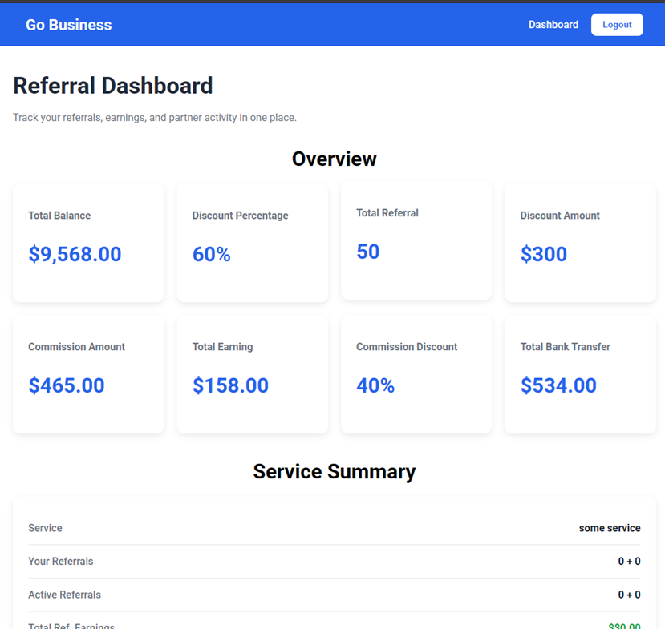
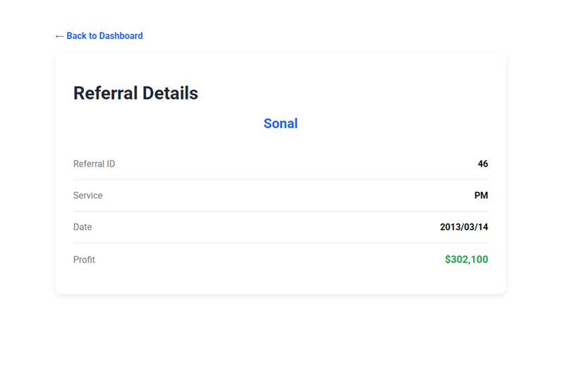

# 🚀 Go Business – Referral Dashboard

A modern, responsive **Referral Dashboard** built using **React + Vite**. The application provides secure authentication, referral management, business analytics, search, sorting, pagination, and referral details through a clean and user-friendly interface.

> 💼 This project was developed as part of a **Frontend Developer Coding Assessment**.


## 🌐 Live Demo

🔗 **Live URL:** [https://your-vercel-link.vercel.app](go-business-referral-dashboard-henna.vercel.app)

---

## 📂 GitHub Repository

🔗 **Repository:** https://github.com/PackiyaRaj025/go-business-referral-dashboard

---

# 📸 Application Screenshots

## 🔐 Login Page

<p align="center">
  
</p>

---

## 📊 Dashboard

<p align="center">
  
</p>

---

## 📄 Referral Details

<p align="center">
  
</p>

---

# ✨ Features

- 🔐 JWT Authentication
- 🍪 Cookie-Based Session Management
- 🛡 Protected Routes
- 📊 Dashboard Overview Metrics
- 📈 Service Summary
- 🔗 Referral Link & Referral Code
- 📋 Copy Referral Link & Code
- 🔍 Search Referrals
- ↕ Sort Referrals by Date
- 📑 Client-side Pagination (10 Rows per Page)
- 📄 Referral Details Page
- 🚪 Logout Functionality
- ⏳ Loading State
- ❌ Error Handling
- 📱 Fully Responsive UI

---

# 🛠 Tech Stack

### Frontend

- React.js
- Vite
- JavaScript (ES6+)
- CSS3
- React Router DOM

### Authentication

- JWT Authentication
- js-cookie

### API

- REST API
- Fetch API

---

# 📁 Folder Structure

```text
src/
│
├── components/
│   ├── Navbar/
│   ├── Footer/
│   ├── Overview/
│   ├── ServiceSummary/
│   ├── ShareReferral/
│   └── ReferralTable/
│
├── pages/
│   ├── Login/
│   ├── Dashboard/
│   ├── ReferralDetails/
│   └── NotFound/
│
├── routes/
│   └── ProtectedRoute.jsx
│
├── services/
│   ├── authApi.js
│   └── referralApi.js
│
├── App.jsx
├── main.jsx
└── index.css
```

---

# 🔐 Authentication Flow

```text
User Login
     │
     ▼
Authentication API
     │
     ▼
Receive JWT Token
     │
     ▼
Store JWT in Cookies
     │
     ▼
Protected Route
     │
     ▼
Dashboard
```

---

# 📊 Dashboard Modules

### 📈 Overview

- Total Referrals
- Active Referrals
- Total Earnings
- Conversion Rate

### 📋 Service Summary

- Service Name
- Referral Count
- Active Referrals
- Total Earnings

### 🔗 Share Referral

- Copy Referral Link
- Copy Referral Code

### 📑 Referral Management

- Search Referrals
- Sort by Date
- View Referral Details
- Pagination

---

# 🚀 Installation

### Clone Repository

```bash
git clone https://github.com/PackiyaRaj025/go-business-referral-dashboard.git
```

### Navigate

```bash
cd go-business-referral-dashboard
```

### Install Packages

```bash
npm install
```

### Run Project

```bash
npm run dev
```

---

# 📦 Build

```bash
npm run build
```

---

# 📱 Responsive Design

This application is fully responsive and optimized for:

- 💻 Desktop
- 📱 Mobile
- 📟 Tablet

---

# 🧠 React Concepts Used

- Functional Components
- useState
- useEffect
- React Router
- Protected Routes
- Controlled Components
- Conditional Rendering
- Component Reusability
- Props
- Event Handling

---

# 🚀 Future Improvements

- 🌙 Dark Mode
- 📊 Dashboard Charts
- 📤 Export Referral Report
- 🔔 Toast Notifications
- 🧪 Unit Testing
- 🌐 Multi-language Support

---

# 👨‍💻 Author

## **Packiyaraj V**

🎓 BE Computer Science & Engineering

💻 Frontend Developer | MERN Stack Learner

### GitHub

https://github.com/PackiyaRaj025

### LinkedIn

https://www.linkedin.com/in/packiyaraj-v-5a220530a/

---

# ⭐ Support

If you found this project helpful, consider giving it a ⭐ on GitHub.
